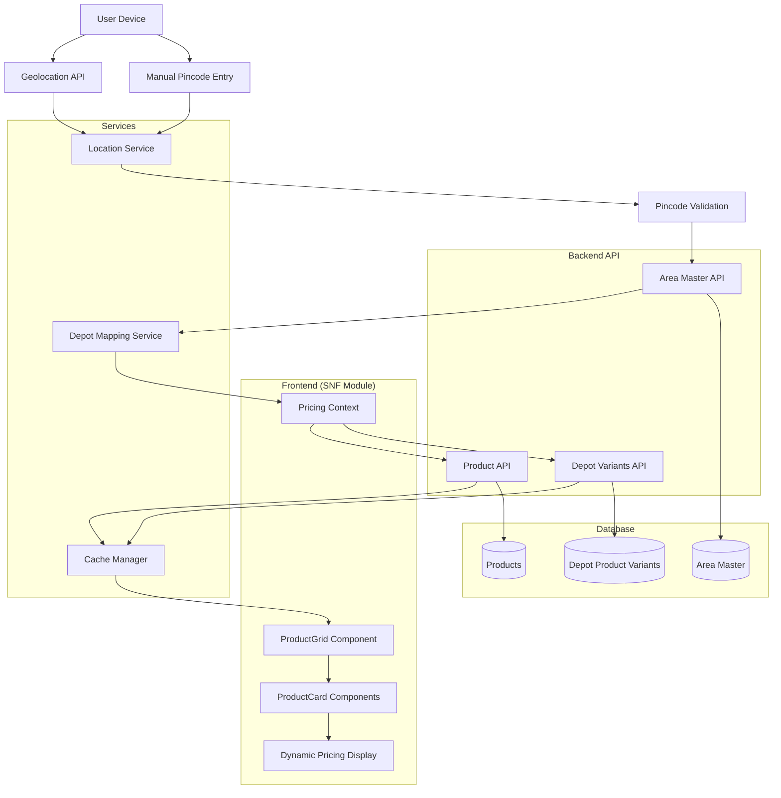
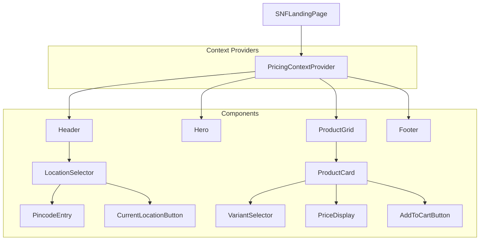
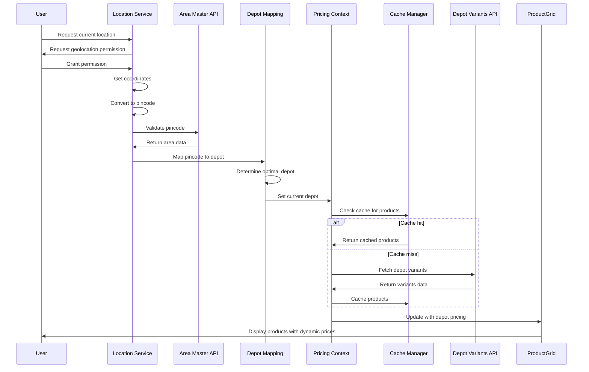
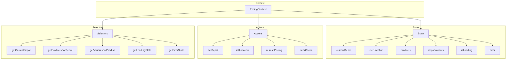
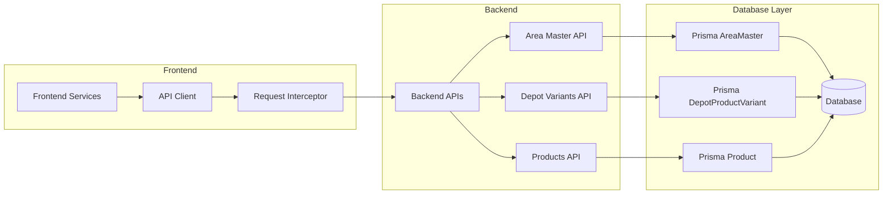
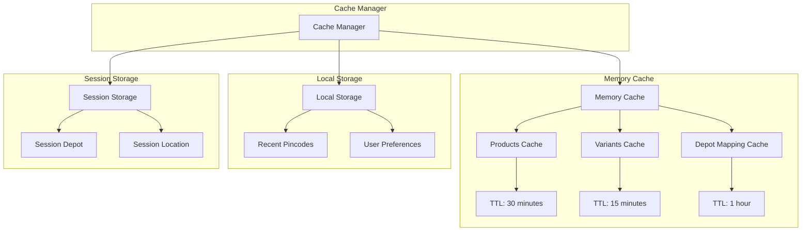
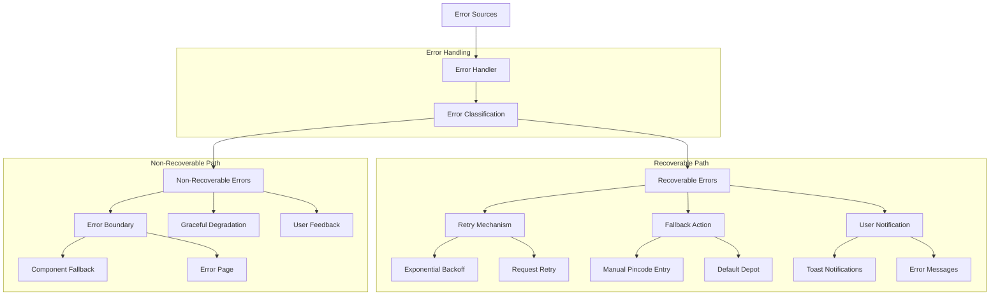
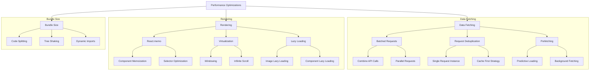
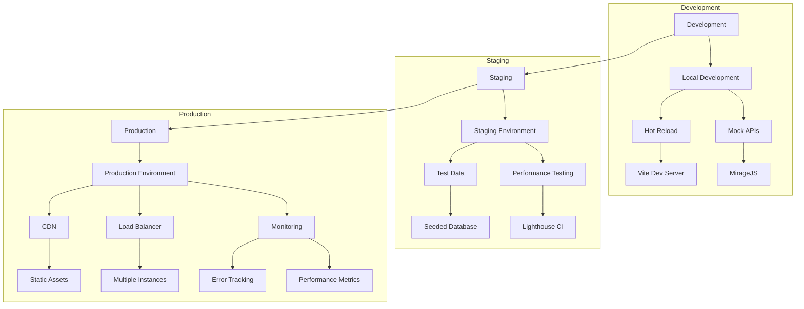

# Dynamic Pricing System Architecture Diagram

## System Flow Overview

## Component Architecture

## Data Flow Diagram

## State Management Architecture

## API Integration Architecture

## Cache Architecture

## Error Handling Architecture

## Performance Optimization Architecture

## Testing Architecture

```mermaid
graph TD
    A[Testing Strategy] --> B[Unit Tests]
    A --> C[Integration Tests]
    A --> D[E2E Tests]

    B --> E[Service Tests]
    B --> F[Hook Tests]
    B --> G[Utility Tests]

    C --> H[Component Tests]
    C --> I[Context Tests]
    C --> J[API Integration Tests]

    D --> K[User Flow Tests]
    D --> L[Performance Tests]
    D --> M[Cross-browser Tests]

    E --> N[Geolocation Service]
    E --> O[Depot Mapping Service]
    E --> P[Cache Service]

    F --> Q[usePricing Hook]
    F --> R[useDepot Hook]
    F --> S[useLocation Hook]

    G --> T[Filtering Utils]
    G --> U[Validation Utils]
    G --> V[Error Utils]

    H --> W[ProductGrid]
    H --> X[ProductCard]
    H --> Y[LocationSelector]

    I --> Z[Pricing Context]
    I --> AA[State Management]

    J --> BB[API Client]
    J --> CC[Error Handling]

    K --> DD[Location Detection]
    K --> EE[Pincode Entry]
    K --> FF[Price Updates]

    L --> GG[Load Testing]
    L --> HH[Cache Performance]

    M --> II[Mobile Responsiveness]
    M --> JJ[Browser Compatibility]

    subgraph "Unit Tests"
        B
        E
        F
        G
        N
        O
        P
        Q
        R
        S
        T
        U
        V
    end

    subgraph "Integration Tests"
        C
        H
        I
        J
        W
        X
        Y
        Z
        AA
        BB
        CC
    end

    subgraph "E2E Tests"
        D
        K
        L
        M
        DD
        EE
        FF
        GG
        HH
        II
        JJ
    end
```

## Deployment Architecture

