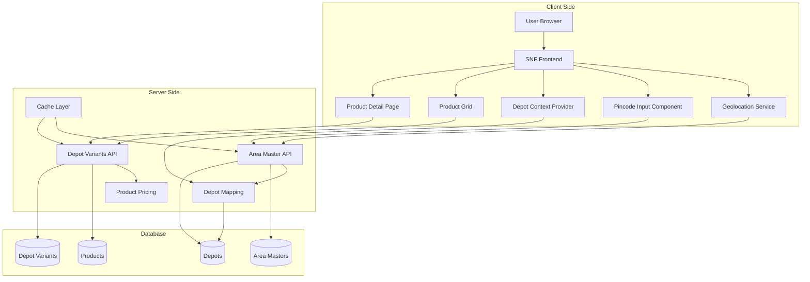
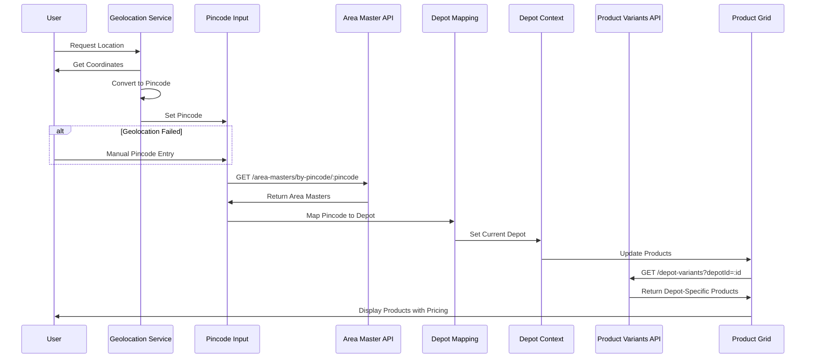
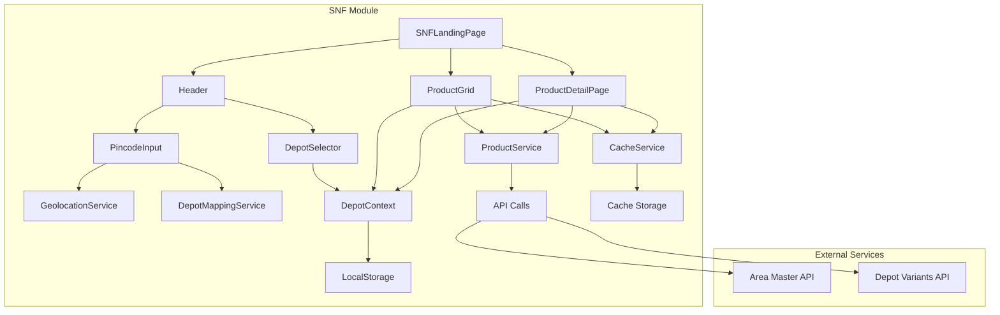
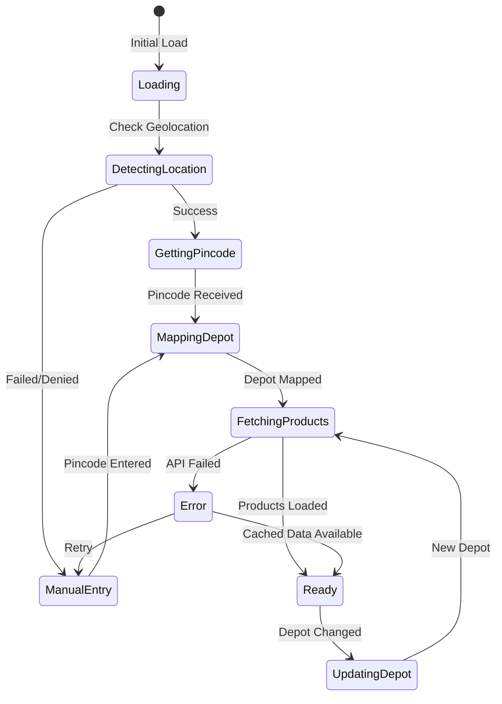
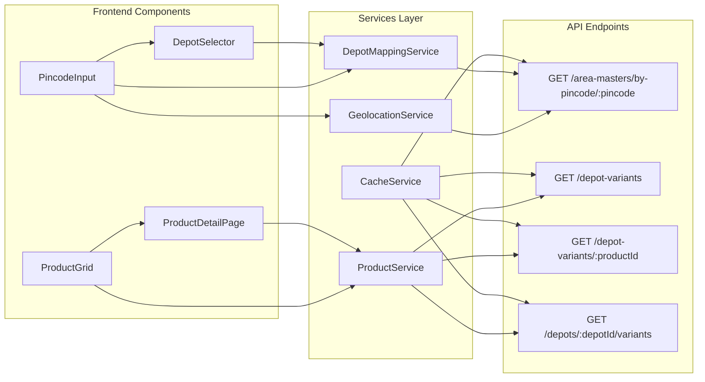
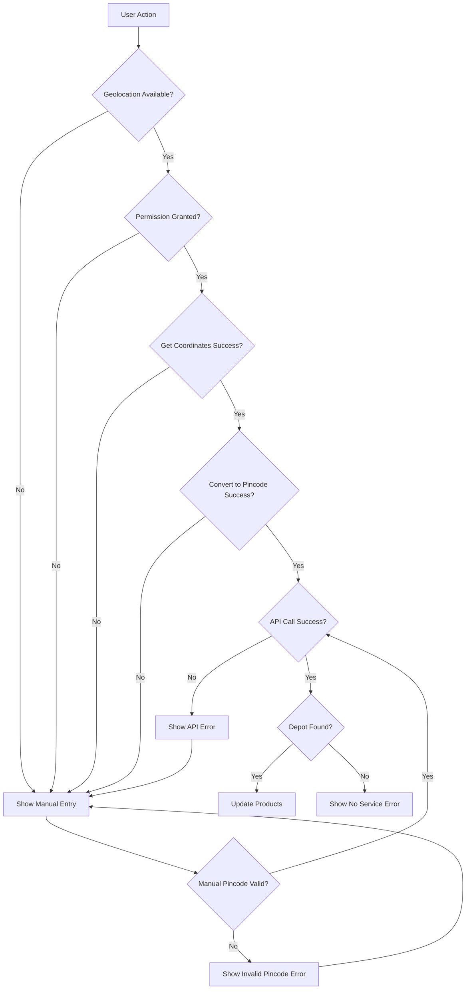
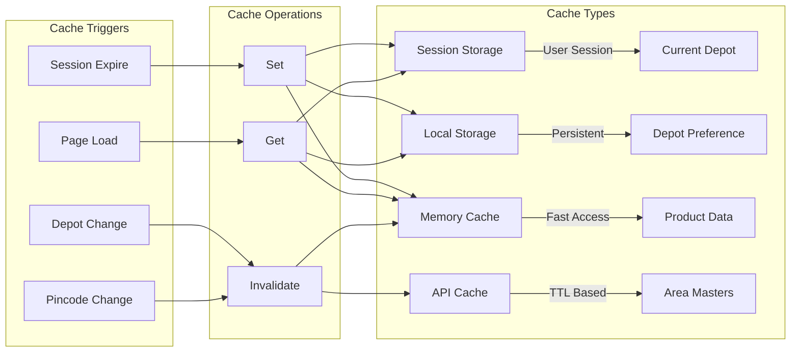
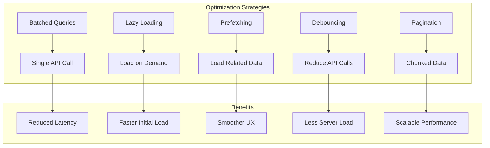

# Dynamic Product Pricing System - Architecture Diagrams

## 1. System Architecture Overview

## 2. Data Flow Diagram

## 3. Component Architecture

## 4. State Management Flow

## 5. API Integration Flow

## 6. Error Handling Flow

## 7. Cache Strategy

## 8. Performance Optimization

These diagrams illustrate the complete architecture and data flow for the dynamic product pricing system, showing how all components interact to provide depot-specific pricing based on the user's location.
